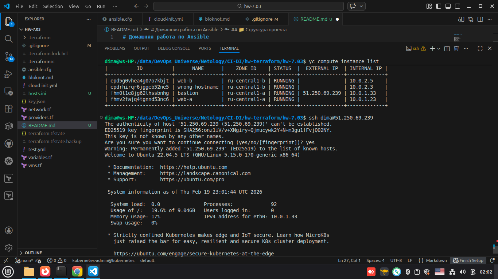
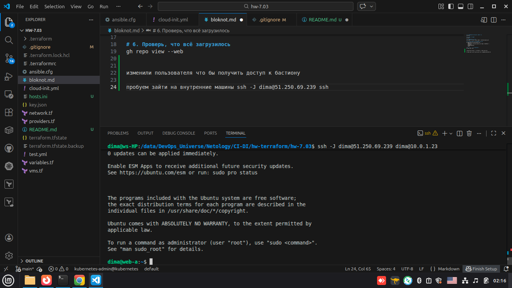
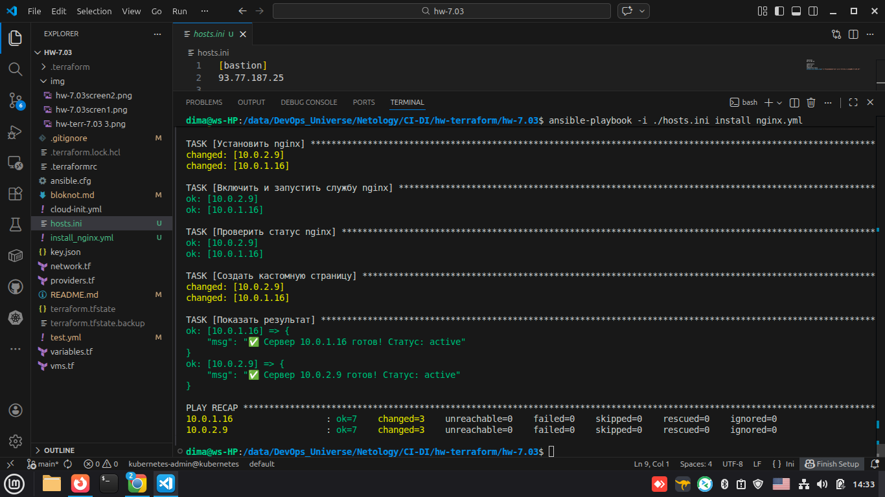
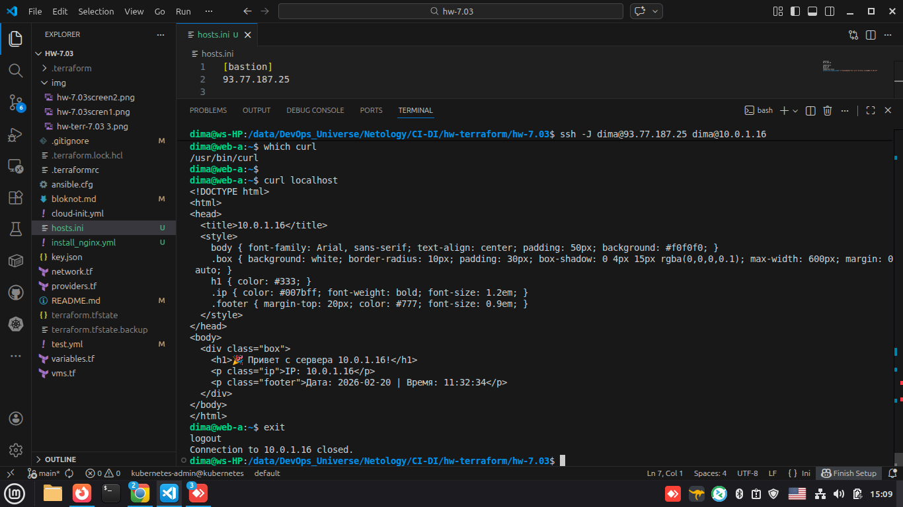

# Домашняя работа по Ansible

Студент: **Герасин Дмитрий Сергеевич**  
Курс: Netology, CI/CD  
Дата: 20.02.2026

---

## 📁 Структура проекта

```
.
├── ansible.cfg
├── bloknot.md
├── cloud-init.yml
├── key.json
├── network.tf
├── providers.tf
├── README.md
├── terraform.tfstate
├── terraform.tfstate.backup
├── test.yml
├── variables.tf
└── vms.tf
```
---
вставить структуру картинку

---


---

В рамках выполнения домашнего задания была повторена демонстрация с лекции 

машины созданы, подключения настроены плейбук test.yml отработал

---





---


Задание 2
С помощью ansible подключиться к web-a и web-b , установить на них nginx.(написать нужный ansible playbook)

Провести тестирование и приложить скриншоты развернутых в облаке ВМ, успешно отработавшего ansible playbook.

---

```yml
---
- name: Установка nginx на веб-серверы
  hosts: webservers
  become: yes
  tasks:
    - name: Обновить кэш пакетов
      apt:
        update_cache: yes
        cache_valid_time: 3600

    - name: Установить nginx
      apt:
        name: nginx
        state: present

    - name: Включить и запустить службу nginx
      systemd:
        name: nginx
        state: started
        enabled: yes

    - name: Проверить статус nginx
      command: systemctl is-active nginx
      register: nginx_status
      changed_when: false

    - name: Создать кастомную страницу
      copy:
        content: |
          <!DOCTYPE html>
          <html>
          <head>
            <title>{{ inventory_hostname }}</title>
            <style>
              body { font-family: Arial, sans-serif; text-align: center; padding: 50px; background: #f0f0f0; }
              .box { background: white; border-radius: 10px; padding: 30px; box-shadow: 0 4px 15px rgba(0,0,0,0.1); max-width: 600px; margin: 0 auto; }
              h1 { color: #333; }
              .ip { color: #007bff; font-weight: bold; font-size: 1.2em; }
              .footer { margin-top: 20px; color: #777; font-size: 0.9em; }
            </style>
          </head>
          <body>
            <div class="box">
              <h1>🎉 Привет с сервера {{ inventory_hostname }}!</h1>
              <p class="ip">IP: {{ ansible_default_ipv4.address }}</p>
              <p class="footer">Дата: {{ ansible_date_time.date }} | Время: {{ ansible_date_time.time }}</p>
            </div>
          </body>
          </html>
        dest: /var/www/html/index.html
        mode: '0644'

    - name: Показать результат
      debug:
        msg: "✅ Сервер {{ inventory_hostname }} готов! Статус: {{ nginx_status.stdout }}"
```


выполняем плейбук




проверяем подключение 
проверяем службу



---
---
основные задания выполнены